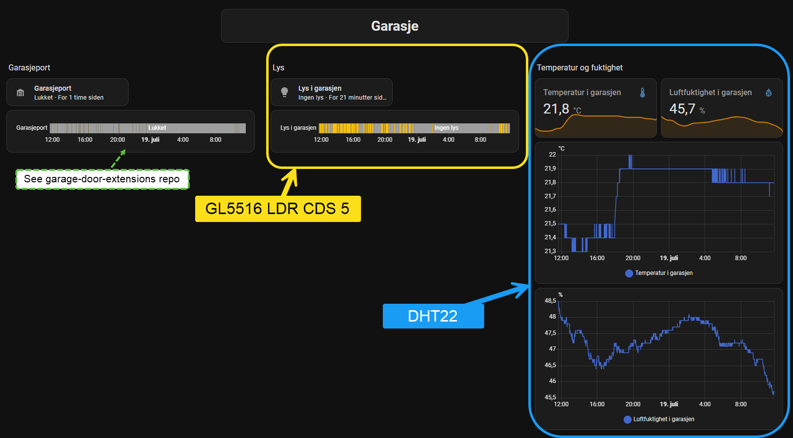
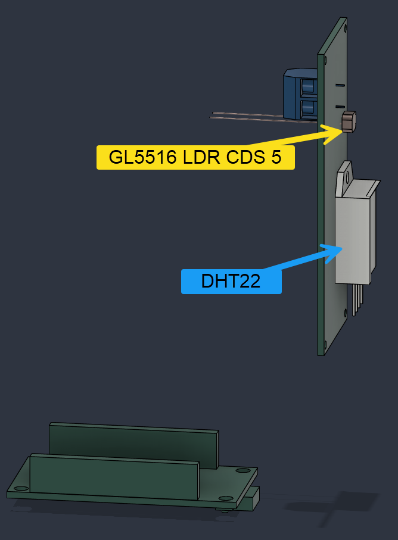
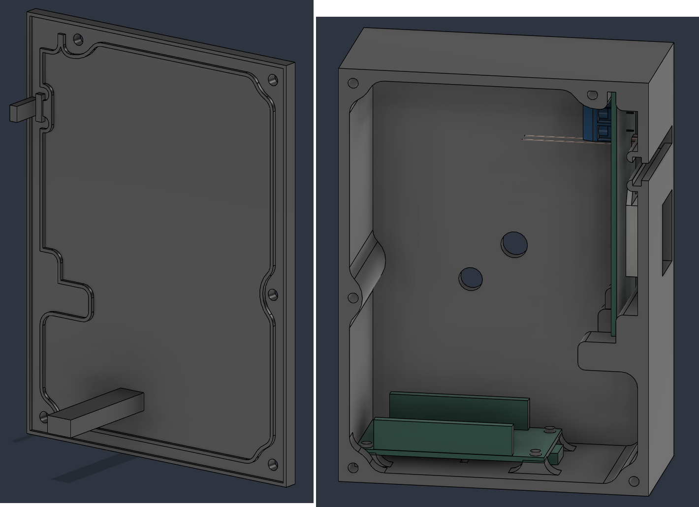
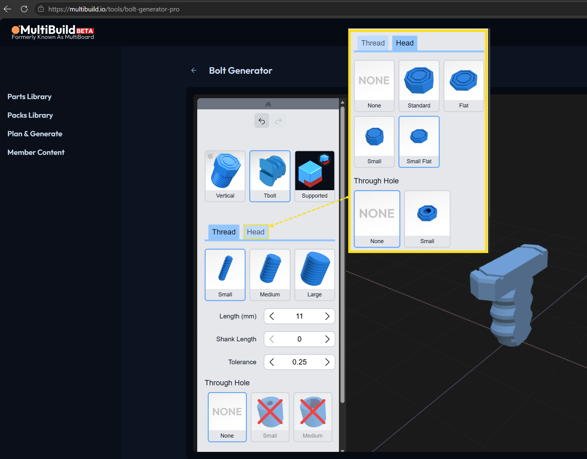
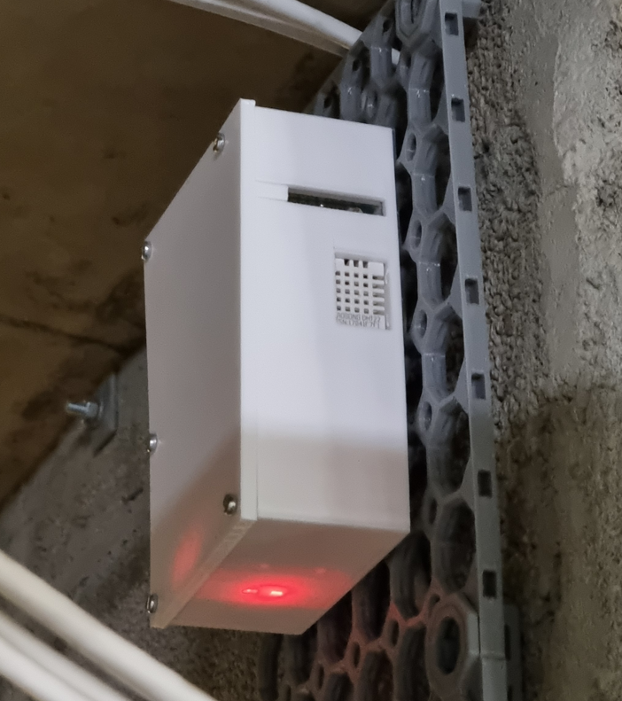

# An ESP32 light and temp/humidity sensor module for Home Assistant
A simple project using ESP32 to report light sensor, temperature and humidity data over MQTT to Home Assistant.

## Home assistant dashboard
The Home Assistant dashboard for this sensor could look something like this:


This dashboard also includes sensor data from the garage door, provided by another project: https://github.com/blog-eivindgl-com/garage-door-extensions

## Component list
 - [ESP32 WROOM dev board](https://www.aliexpress.com/item/1005005655238798.html) (or similar)
 - [GL5516 LDR CDS 5 light sensor](https://www.aliexpress.com/item/1005007522318459.html)
 - [DHT22 temperature and humidity sensor](https://www.aliexpress.com/item/1005007188553339.html)
 - [10kΩ resistors](https://www.aliexpress.com/item/1005011772534173.html)
 - [Perf board](https://www.aliexpress.com/item/1005001704591847.html)
 - [18awg solid core wires](https://www.temu.com/no-en/18-20-22-24-awg-wire-solid-core--wire-6-different-colored-breadboard-wires-18-24gauge-electronic-wire-with-pvc-for--g-605656169989220.html)
 - Flexible signal cables between the ESP32 and the perf board
 - Power cables from an external power source
 - 2mm acrylic transparent plate cut into a 8mm x 35mm pice
 - 5 M3 screws for attaching the lid to the box
 - Fire resistant filament for 3D printed housing

## Electronics
Prototyping sketch for wiring components:


Refer to [this spreadsheet](https://github.com/user-attachments/files/29973649/Temp-light.soldering.sketch.ods) which documents soldering the same connections on a perf board. That also includes screw terminals for 5V DC power cables from an external source and flexible wires between the perf board and the ESB32 dev board.

The 3D model gives a visual clue on how to arrange the components on the perf board:


## Source code
The esp32_light_and_temp_sensor_module.ino file contains C++ code which can be used with Arduino IDE to upload the program to the dev board.

It requires a local parameters.h file, which contains secrets for the local environment like WiFi password and MQTT broker parameters. Use the following template:
```
#ifndef GARAGELIGHT_PARAMETERS_H
#define GARAGELIGHT_PARAMETERS_H

// Secrets
const char *wifi_ssid = "<your-wifi-ssid>"; 
const char *wifi_password = "<your-wifi-password>";

const char *mqttServer = "<your-mqtt-broker-ip-or-dns>";
const char *mqtt_user = "<your-mqtt-broker-username>";
const char *mqtt_password = "<your-mqtt-broker-password>";

// Other environment parameters
const char *ntpServer1 = "<local-time-server-or-some-external-time-server>";
const char *ntpServer2 = "time.nist.gov";
const long gmtOffset_sec = 3600;
const int daylightOffset_sec = 3600;
const char *time_zone = "CET-1CEST,M3.5.0,M10.5.0/3";  // TimeZone rule for Europe/Rome including daylight adjustment rules (optional)

#endif
```

### Reqired libraries
 - [PubSubClient](http://pubsubclient.knolleary.net/) for MQTT messages
 - [WiFi library for Arduino](https://github.com/arduino-libraries/WiFi)
 - [DHT sensor library](https://github.com/adafruit/DHT-sensor-library)

## 3D printed case
 A box wrapping the electronics. Perf board with sensors is located at the right side of the box, using an acrylic window for the light sensor, and providing a cutout for the DHT22 sensor. ESP32 board is located upside down on the bottom side of the box. 


The box has cutouts for the two onboard LEDs and push buttons of a standard ESP32-WROOM-32 dev board, giving access to the reset button using a toothpicker.

 The backside of the box has cutouts for an Ethernet cable, but only two wires are used to provide power from a 5V DC source. There's also a hole for the Multibuild Tbolt used to mount the box to a [Multibuild tile](https://docs.multibuild.io/beginner-section/core-parts-documentation#1-multiboard-tile) on a standard small thread hole. I used the [Bolt Generator](https://multibuild.io/tools/bolt-generator-pro) to create a custom Tbolt with small threads, 11mm length with a Small Flat head:
 

Feel free to mount this in a much simpler way. I just like Multibuild's flexibilty instead of drilling holes in the wall for every project I make.

Use fire resistant filament when 3D printing housing for electronics. Picture of the complete box mounted to a Multibuild tile:


Step files for the box and lid are provided in the 3d_model folder together with the Fusion360 f3d file, which should give you several options to modify the model to your needs. There's also a 3mf file for the slicer program. The 3D model files are also shared on [Printables](https://www.printables.com/model/1785509-esp32-light-and-temperaturehumidity-project-for-ho).
